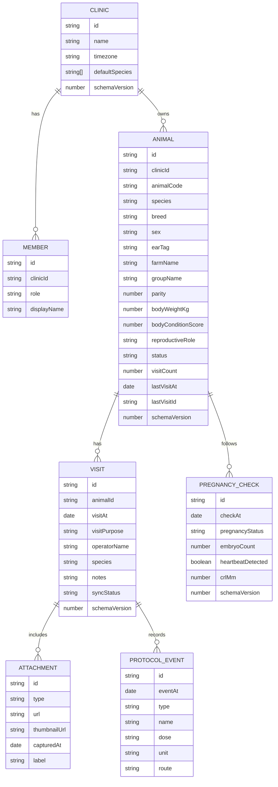
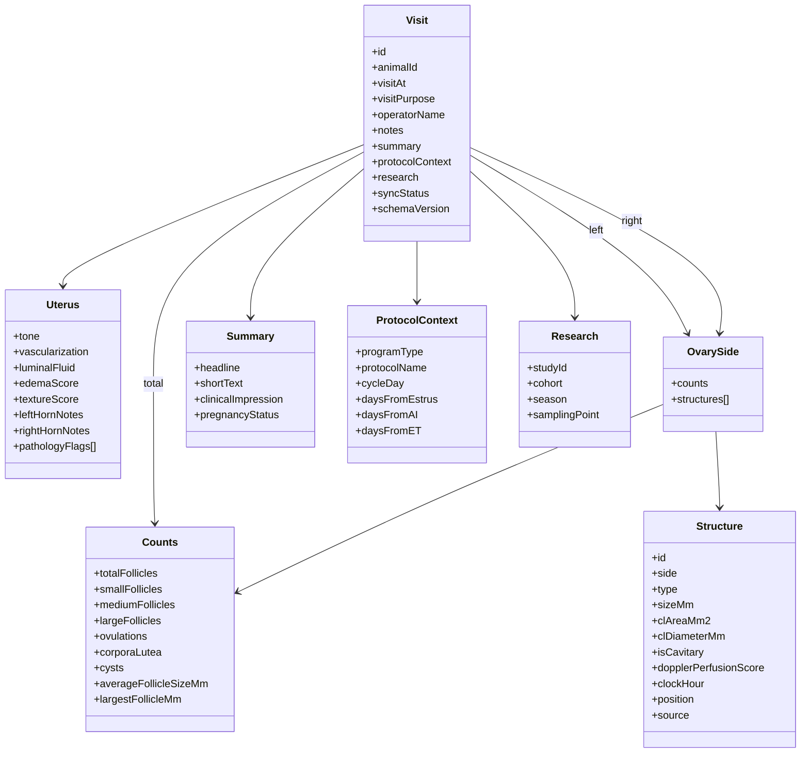

# Embryo Sardegna Data Model V2

Status: `FROZEN`

Last updated: `2026-04-05`

This document defines the domain model for the Embryo Sardegna prototype. The goal is to keep the architecture flexible, modular, and ready for both web and mobile clients, with an online database as the source of truth and local cache for offline operation.

## Design Goals

- Keep the `core` model stable and portable across web and app.
- Separate clinical data from UI concerns.
- Preserve both `raw scan detail` and `derived summaries`.
- Allow optional fields and future expansion without breaking old records.
- Support scientific analysis, exports, and longitudinal reproductive follow-up.
- Support `ovine` now and `bovine` later.

## Collection Hierarchy

```text
clinics/{clinicId}
clinics/{clinicId}/members/{userId}
clinics/{clinicId}/animals/{animalId}
clinics/{clinicId}/animals/{animalId}/visits/{visitId}
clinics/{clinicId}/animals/{animalId}/visits/{visitId}/attachments/{attachmentId}
clinics/{clinicId}/animals/{animalId}/visits/{visitId}/events/{eventId}
clinics/{clinicId}/animals/{animalId}/pregnancyChecks/{checkId}
```

## What "Official Enums" Means

`Official enums` are closed lists of allowed values.  
They are important because they keep naming consistent across:

- web app
- future mobile app
- backend
- analytics
- export to Excel

Example: if one screen saves `recipient`, another saves `Recipient`, and a third saves `ricevente`, statistics become fragile.  
An enum prevents this by declaring one canonical value only.

## Official Enums

### Species

```text
ovine
bovine
```

### Sex

```text
female
male
unknown
```

### Animal Status

```text
active
inactive
archived
sold
deceased
```

### Reproductive Role

```text
recipient
donor
breeding_female
breeding_male
monitoring_only
```

### Lactation Status

```text
dry
lactating
unknown
```

### Visit Purpose

```text
follicular_monitoring
recipient_selection
breeding_exam
pregnancy_diagnosis
follow_up
male_repro_exam
research_scan
```

### Program Type

```text
natural_mating
ai
tai
et
moet
synchronization
unknown
```

### Structure Type

```text
follicle
ovulation
corpus_luteum
cyst
other
```

### Scan Source

```text
tap
drag
voice
import
manual_entry
```

### Event Type

```text
hormone
device_inserted
device_removed
estrus_observed
ai
et
natural_mating
pregnancy_diagnosis
clinical_note
other
```

### Pregnancy Status

```text
unknown
suspected
positive
negative
loss_suspected
loss_confirmed
completed
```

### Attachment Type

```text
image
video
snapshot
document
report
```

### Season

```text
breeding
non_breeding
transitional
unknown
```

### Sync Status

```text
pending
synced
error
```

## Core Entities

## Clinic

```json
{
  "id": "clinic_main",
  "name": "Embryo Sardegna",
  "timezone": "Europe/Rome",
  "defaultSpecies": ["ovine", "bovine"],
  "createdAt": "ISO_DATE",
  "schemaVersion": 2
}
```

## Animal

Required fields:

- `id`
- `clinicId`
- `animalCode`
- `species`
- `status`
- `schemaVersion`

Recommended fields:

```json
{
  "id": "animal_001",
  "clinicId": "clinic_main",
  "animalCode": "OV-184",
  "displayName": "OV-184",
  "species": "ovine",
  "breed": "Sarda",
  "sex": "female",
  "earTag": "IT0123456789",
  "farmId": "farm_01",
  "farmName": "Azienda Rossi",
  "groupId": "grp_recipients_a",
  "groupName": "Recipienti A",
  "birthDate": null,
  "ageMonths": null,
  "parity": 2,
  "bodyWeightKg": null,
  "bodyConditionScore": null,
  "lactationStatus": "dry",
  "reproductiveRole": "recipient",
  "status": "active",
  "notes": "",
  "researchTags": [],
  "visitCount": 12,
  "lastVisitAt": "ISO_DATE",
  "lastVisitId": "visit_0012",
  "lastVisitSummary": {
    "totalFollicles": 14,
    "smallFollicles": 3,
    "mediumFollicles": 8,
    "largeFollicles": 3,
    "ovulations": 1,
    "corporaLutea": 1,
    "uterusTone": 2,
    "uterusVascularization": 2,
    "uterusLuminalFluid": 1,
    "pregnancyStatus": "unknown"
  },
  "speciesData": {
    "ovine": {
      "flockRole": "recipient",
      "ramExposureDate": null
    },
    "bovine": {
      "lactationNumber": null,
      "daysInMilk": null,
      "postpartumDays": null,
      "milkYieldKg": null
    }
  },
  "extensions": {},
  "createdAt": "ISO_DATE",
  "updatedAt": "ISO_DATE",
  "updatedBy": "user_01",
  "deletedAt": null,
  "schemaVersion": 2
}
```

## Visit

Required fields:

- `id`
- `animalId`
- `visitAt`
- `ovaries`
- `summary`
- `schemaVersion`

Recommended fields:

```json
{
  "id": "visit_0012",
  "clinicId": "clinic_main",
  "animalId": "animal_001",
  "visitAt": "ISO_DATE",
  "visitPurpose": "follicular_monitoring",
  "operatorId": "user_01",
  "operatorName": "Antonio Spezzigu",
  "deviceId": "tablet_01",
  "species": "ovine",
  "notes": "FOSCHIA",
  "annotationText": "",
  "examMode": {
    "bMode": true,
    "doppler": false
  },
  "uterus": {
    "tone": 2,
    "vascularization": 2,
    "luminalFluid": 1,
    "edemaScore": null,
    "textureScore": null,
    "leftHornNotes": "",
    "rightHornNotes": "",
    "pathologyFlags": []
  },
  "ovaries": {
    "left": {
      "counts": {
        "totalFollicles": 7,
        "smallFollicles": 2,
        "mediumFollicles": 4,
        "largeFollicles": 1,
        "ovulations": 1,
        "corporaLutea": 0,
        "cysts": 0,
        "averageFollicleSizeMm": 4.1,
        "largestFollicleMm": 6
      },
      "structures": []
    },
    "right": {
      "counts": {
        "totalFollicles": 7,
        "smallFollicles": 1,
        "mediumFollicles": 4,
        "largeFollicles": 2,
        "ovulations": 0,
        "corporaLutea": 1,
        "cysts": 0,
        "averageFollicleSizeMm": 4.8,
        "largestFollicleMm": 7
      },
      "structures": []
    },
    "total": {
      "totalFollicles": 14,
      "smallFollicles": 3,
      "mediumFollicles": 8,
      "largeFollicles": 3,
      "ovulations": 1,
      "corporaLutea": 1,
      "cysts": 0
    }
  },
  "summary": {
    "headline": "14 follicoli, 1 OV sx, 1 CL dx",
    "shortText": "T2 V2 L1",
    "clinicalImpression": "",
    "pregnancyStatus": "unknown"
  },
  "protocolContext": {
    "programType": "et",
    "protocolName": "Recipient protocol A",
    "cycleDay": null,
    "daysFromEstrus": null,
    "daysFromAI": null,
    "daysFromET": null
  },
  "research": {
    "studyId": null,
    "cohort": null,
    "season": "breeding",
    "samplingPoint": null
  },
  "extensions": {},
  "createdAt": "ISO_DATE",
  "updatedAt": "ISO_DATE",
  "updatedBy": "user_01",
  "syncStatus": "synced",
  "schemaVersion": 2
}
```

## Structure

This is the raw ultrasound finding used to redraw the full-screen detailed visit.

```json
{
  "id": "str_001",
  "side": "L",
  "type": "follicle",
  "sizeMm": 4.5,
  "clAreaMm2": null,
  "clDiameterMm": null,
  "isCavitary": null,
  "dopplerPerfusionScore": null,
  "clockHour": 6,
  "position": {
    "x": 0.42,
    "y": 0.67,
    "normalized": true
  },
  "source": "tap",
  "notes": "",
  "createdAt": "ISO_DATE"
}
```

Notes:

- `position.x` and `position.y` must be normalized between `0` and `1`.
- This makes the same visit redraw correctly on phone, tablet, and desktop.

## Protocol Event

```json
{
  "id": "evt_001",
  "eventAt": "ISO_DATE",
  "type": "hormone",
  "name": "PGF2alpha",
  "dose": "1",
  "unit": "ml",
  "route": "im",
  "notes": ""
}
```

## Pregnancy Check

```json
{
  "id": "preg_001",
  "checkAt": "ISO_DATE",
  "method": "ultrasound",
  "daysFromBreeding": 25,
  "pregnancyStatus": "positive",
  "embryoCount": 2,
  "heartbeatDetected": true,
  "fetalViability": "normal",
  "crlMm": null,
  "estimatedGestationalAgeDays": null,
  "notes": "",
  "schemaVersion": 2
}
```

## Attachment

Attachments are included in `V2` from the start.

```json
{
  "id": "att_001",
  "type": "image",
  "url": "REMOTE_URL",
  "thumbnailUrl": "REMOTE_URL",
  "capturedAt": "ISO_DATE",
  "label": "Ovaio dx",
  "notes": ""
}
```

## Derived Data Rules

The following values should be stored explicitly, not only computed on the fly:

- `visit.summary`
- `visit.ovaries.left.counts`
- `visit.ovaries.right.counts`
- `visit.ovaries.total`
- `animal.lastVisitSummary`
- `animal.visitCount`
- `animal.lastVisitAt`

Reason:

- faster UI
- simpler exports
- easier statistics
- stable historical snapshots

## MVP Visibility vs Hidden Advanced Fields

For the first presentation demo:

- visible now:
  - animal list
  - create/select animal
  - last 3 visits
  - full visit history
  - detailed ultrasound visit
  - attachments
  - uterus scores
  - follicle counts and structures
- hidden or secondary UI:
  - research block
  - bovine-only fields
  - advanced pathology
  - Doppler scores
  - pregnancy follow-up details

This keeps the architecture complete while the UI stays focused.

## ER Diagram



## Visit Internal Composition



## Versioning Rules

- Every top-level entity carries `schemaVersion`.
- New fields should be added as optional by default.
- Old records must remain readable with defaults.
- UI must consume normalized repository objects, not raw database documents.

## Repository Boundary

Clients must not talk directly to the database. All reads and writes should go through a repository layer.

Minimum repository contract:

```text
listAnimals()
createAnimal(payload)
updateAnimal(animalId, patch)
getAnimal(animalId)
listAnimalVisits(animalId)
getVisit(animalId, visitId)
saveVisit(animalId, visitPayload)
listPregnancyChecks(animalId)
savePregnancyCheck(animalId, payload)
saveVisitAttachment(animalId, visitId, payload)
saveProtocolEvent(animalId, visitId, payload)
```

This is the main safeguard against tight coupling between UI and backend.
